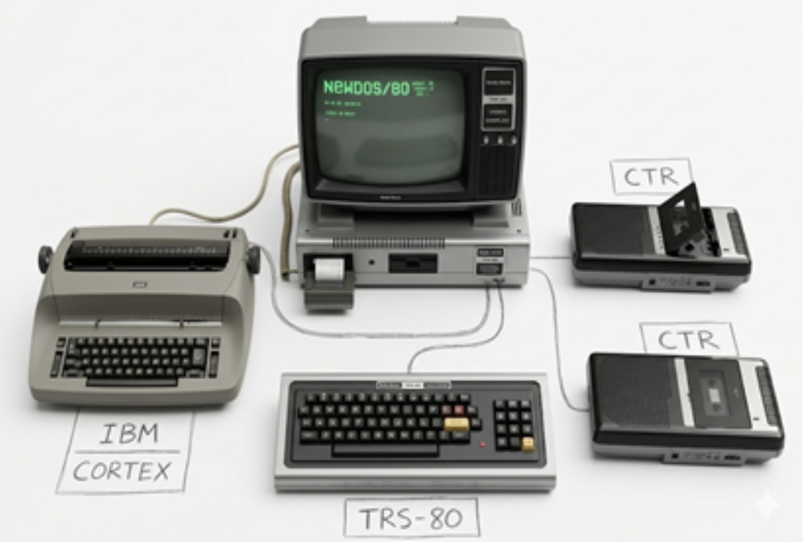

# CORTEX© 1980 — A Pioneering Desktop Publishing System for the TRS-80

**Identifiant de préservation (SWHID) :**
`swh:1:rev:5e1645390d1977cb9023a663fc34b6e51a6becdc`

*💡 Cliquez sur l'image ci-dessus pour consulter Histoire_du_Projet "cortex_80.pdf"

[English version](#historical-overview) | [Version française](#historique-du-projet)

## Historical Overview

>CORTEX© (**COmposition Rédactionnelle de TEXte**) is a pioneering French text composition and editing system developed between 1979 and 1980 by Jean-Pierre Castejon at **University Paris VIII**. The project was developed under the scientific influence of **Jérôme Chailloux** 
>(creator of Le-Lisp and VLISP) => (member of the VLISP team and main architect of Le-Lisp).
A Testimonial from Jérôme Chailloux:

>"The CORTEX thesis remains a wonderful memory for me. At a time when Desktop Publishing (DTP) had not yet been born, it took a great deal of imagination, inventiveness, and expertise to build such a pioneering system, despite all the hardware and software limitations.
>And what a preservation effort! Roberto [Di Cosmo] and 'History' will be delighted."

**From Craftsmanship to Innovation:**
Following a serious car accident in 1976, Jean-Pierre Castejon pivoted toward computing. CORTEX was born from this transition, bridging ancestral typographic expertise with the dawn of micro-computing (Z80 / TRS-80). Nearly half a century later, the source code is archived with **Software Heritage** and the **ACONIT** association.

## Evolution & Legacy

* **CORTEX© 1 (1980) :** The stable version documented in this archive.
* **CORTEX© 2 :** Integration of J. Chailloux’s hyphenation algorithm and optimization of Selectric 1 timing loops.
* **1985 :** Concurrently with the rise of external DTP standards (Macintosh, PostScript), our work shifted toward a new generation of expert systems and portability to 64-bit PCs and large-scale phototypesetting systems.
* **Post-1985 (Expert Systems, 64-bit PCs, NeoCortex) :**
    * **MEPA© (Mise En Page Automatique):** A portable C-language system for professional press layout.
    * **PANDA©:** Automated layout for classified ads (multi-criteria addressing, vertical justification).
    * **BECHOS©:** Real-time financial data processing for *Les Échos* stock market pages.
    * **SYFI© (Synthèse Financière):** Fully tagged editorial journal synthesis.
    * **... and others.**

Built on a Radio-Shack **TRS-80 Model I** with only 48 KB of RAM and programmed in **Zilog Z80 assembly language**, CORTEX transformed a consumer microcomputer into a professional workstation. It was capable of driving an **IBM Selectric** typeball system through a custom electronic interface based on the **Intel 8255 PPI**.

At a time when punched tapes and blind text entry were the industry standard, CORTEX already featured:
*   **On-screen text editing** with real-time feedback.
*   **Primitive WYSIWYG correction** and automated typographic composition.
*   **Real-time layout computation** integrated with the editing process.
*   **Hardware/Software synchronization** designed to handle electromechanical constraints.

This project stands at the crossroads of traditional typography, phototypesetting, and the DTP (Desktop Publishing) revolution later popularized by the Apple Macintosh, Adobe PostScript, and Aldus PageMaker in the mid-1980s.

---

## Technical Specifications

*   **Platform:** TRS-80 Model I (48 KB RAM)
*   **Processor:** Zilog Z80A (Assembly Language)
*   **Output Device:** IBM Selectric Typeball (via 11-magnet hardware control)
*   **Interface:** Custom Intel 8255 Programmable Peripheral Interface (PPI)
*   **Display:** 64 × 16 characters
*   **Innovation:** Real-time timing loops precisely synchronized with the mechanical inertia of the Selectric mechanism.

---

## Digital Heritage & Preservation

This repository is part of a **2026 digital preservation initiative**. The goal is to document and archive a "missing link" in the history of:
*   Early **Desktop Publishing** (DTP / PAO).
*   French Microcomputing and **University Research (Paris VIII)**.
*   Electromechanical text composition and legacy hardware interfacing.
*   **Constraint-based engineering** on 8-bit systems.

CORTEX demonstrates how advanced editorial and typographic concepts were explored years before commercial DTP systems became mainstream.
---

# CORTEX© 1980 — Système de PAO précurseur sur TRS-80

## Historique du projet
=====================================================================

# CORTEX© 1980 : Composition Rédactionnelle de TEXte
======================================================================
## 🖋️ PRÉFACE DE JÉRÔME CHAILLOUX
======================================================================

>"La thèse CORTEX reste pour moi un excellent souvenir. À l'époque où la PAO n'était pas encore née, il a fallu une sacrée dose d'imagination, d'inventivité et de savoir-faire pour construire un tel système, si précurseur, malgré toutes les limitations du matériel et du logiciel.
>Et quel travail de préservation ! C'est Roberto et 'l'Histoire' qui vont être contents."

> — **Jérôme Chailloux** (Père de VLISP, créateur du langage Le-Lisp) 
> (membre de l'équipe VLISP et architecte principal du langage Le-Lisp)

### 🚀 Un tournant décisif : de l'artisanat à l'informatique
À la suite d'un grave accident de voiture en 1976 rendant impossible l'exercice du métier de typographe en position debout, ce projet a marqué un rebond décisif vers l'informatique et la photocomposition dès 1977. CORTEX est ainsi né de la fusion entre un savoir-faire artisanal traditionnel et l'avant-garde technologique de la micro-informatique (Z80 / TRS-80).

======================================================================
## 🛰️ PROLOGUE 2026 : UNE BALISE TEMPORELLE
======================================================================

Ce dépôt constitue une **"balise temporelle"** ouverte en 2026 pour l'archivage patrimonial (**Software Heritage / UNESCO**). Il documente la genèse de **CORTEX**, une innovation majeure de la micro-informatique française des années 80.

### 🚀 Points Clés & Innovation 1980 (SEO)
*   **Pionnier de la PAO :** Transition historique entre la typographie traditionnelle et l'édition sur écran (**WYSIWYG primitif**).
*   **Ingénierie de pointe :** Pilotage d'une **IBM Selectric** (boule) via un processeur **Zilog Z80** (ORG 4300H) et une interface **PPI 8255**.
*   **Symbiose Matérielle :** Collaboration entre l'informatique théorique (Paris VIII), l'électronique discrète et la mécanique de précision (Platine réalisée par un **Meilleur Ouvrier de France**).
*   **Héritage :** Préservation du savoir-faire face à l'obsolescence, du code assembleur aux algorithmes de mise en page.

---

## Système de Composition et Révision de Textes et mise en page sur imprimante à boule IBM
**Archéologie Informatique & Ingénierie de la Contrainte**

---
Note de lecture : > * Pour une lecture optimale de cette archive hors-ligne, utilisez un éditeur compatible Markdown (comme VS Code ctrl maj V) ou Obsidian).

Les listings sources sont au format texte brut, pdf(complet) et asm au choix encodés en UTF-8 pour garantir la pérennité des commentaires. 
==========================================================================

### 1. Informations Générales
* **Conception et Développement :** Jean-Pierre Castejon (Maîtrise informatique, niveau Doctorat)
* **Conseil Scientifique / Mentorat :** Jérôme Chailloux
* **Plateforme :** Radio-Shack TRS-80 (48K RAM) & IBM Selectric (Boule)
* **Statut :** Archivage complet effectué en 2026 pour CORTEX© 1980 
 
---

### 2. Introduction Historique
CORTEX 1980 © est une station précurseur PAO pionnière développée entre 1979 et 1980. Conçue pour transformer un micro-ordinateur TRS-80 en une unité de composition professionnelle, elle permettait de s'affranchir des limites des bandes perforées grâce à une édition directe sur écran (**WYSIWYG primitif**) avant l'impression en 1980.

---

### 3. "La Maîtrise" : Une Ingénierie Hybride
Le projet repose sur une symbiose unique entre le code machine et la mécanique de haute précision :

* **Couplage Matériel (Hardware) :** Pilotage de 11 électro-aimants via une interface 8255 (PPI).
* **Précision MOF :** La platine de fixation des électro-aimants a été réalisée sur mesure par un **Meilleur Ouvrier de France** ajusteur, garantissant l'alignement micrométrique indispensable à la frappe de la boule IBM.
* **Logique Z80 :**
    * Gestion dynamique d'un buffer texte à l'adresse `4516H`.
    * Calcul de matrice de mise en page en temps réel.
    * Implémentation de *Delay Loops* (boucles de temporisation) pour synchroniser le code avec l'inertie physique de la boule Selectric.

---

### 4. Structure du Dépôt (Inventaire)
Le dossier est organisé numériquement pour refléter le cycle de vie du développement :
| Index | Fichier / Dossier | Description |

Markdown
### 4. Structure du Dépôt (Inventaire)

| Index | Document PDF (Cliquer pour ouvrir) | Description |
| :--- | :--- | :--- |
| **0000** | [PROLOGUE 2026](./0000%20PROLOGUE%202026.pdf) | Introduction et genèse du projet. |
| **0000** | [SYNTHÈSE 2026](./0000%20SYNTHÈSE%20ANALYTIQUE%202026%20(%20PAR%20L'IA%20GEMINI).pdf) | Analyse globale par l'IA Gemini. |
| **1000** | [CORTEX_20260430](./1000%20CORTEX_20260430.pdf) | Document de synthèse générale. |
| **1100** | [ANALYSE FONCTIONNELLE](./1100%20–%20CORTEX%20ANALYSE%20FONCTIONNELLE%20SOMMAIRE.pdf) | Logique utilisateur et besoins. |
| **1200** | [ANALYSE ORGANIQUE](./1200%20CORTEX%20ANALYSE%20ORGANIQUE%20.pdf) | Structure interne (Attention à l'espace final). |
| **120H** | [CORTEX HARDWARE](./1200H%20CORTEX%20HARDWARE.pdf) | Spécifications matérielles. |
| **1300** | [PROGRAMMATION](./1300%20CORTEX%20PROGRAMMATION.pdf) | LISTING 1980 et macro **traitecortex**. |
| **1400** | [MISE AU POINT](./1400%20CORTEX%20MISE%20AU%20POINT.pdf) | Rapports de tests et ajustements. |
| **1500** | [UTILISATION](./1500%20UTILISATION%20CORTEX.pdf) | Mode d'emploi de l'environnement. |
| **List** | [LISTING.MD](./LISTING.MD) | Code source et inventaire des macros.

---

### 5. Spécifications Techniques
* **CPU :** Zilog Z80A
* **Adresse de base :** `4300H`
* **Affichage :** 64 caractères x 16 lignes (Standard TRS-80)
* **Points d'entrée clés :** * `DAFF` : Affichage
    * `PCURS` : Gestion du curseur
    * `INIT` : Initialisation système

---
### 6. Évolution et Postérité

* **CORTEX© 1 (1980) :** Version stable documentée ici.
* **CORTEX© 2 :** Intégration de l'algorithme de césure de J. Chailloux et optimisation des timings Selectric.
* **1985 : ** Concomitamment à l'essor des standards PAO externes (Macintosh, PostScript), nos travaux s'orientent vers une nouvelle génération de systèmes experts et la portabilité sur PC 64 bits et gros système de photocomposition.
* **Années 85+ (Systèmes Experts, PC 64 bits, NEOCORTEX) :**
    * **MEPA© (Mise En Page Automatique) :** Système en langage C portable pour le labeur presse.
    * **PANDA© :** MEPA des petites annonces (adressage multicritères, justification verticale).
    * **BECHOS© :** MEPA Bourse des Échos, flux de données en temps réel.
    * **SYFI© :** Synthèse Financière (journal rédactionnel entièrement balisé).
    * **... et autres.**
    * .... 
    C’est en s’affranchissant des cadres établis et en dépassant les limites technologiques de son temps que l’on conçoit de nouvelles passerelles vers l’innovation. Ce projet témoigne de cette volonté de déploiement intellectuel et technique, au-delà des contraintes matérielles de 1980.
    
Jean-Pierre Castejon

> *Ce dépôt constitue une archive de patrimoine numérique, témoignant des solutions d'ingénierie système françaises du début des années 80.*